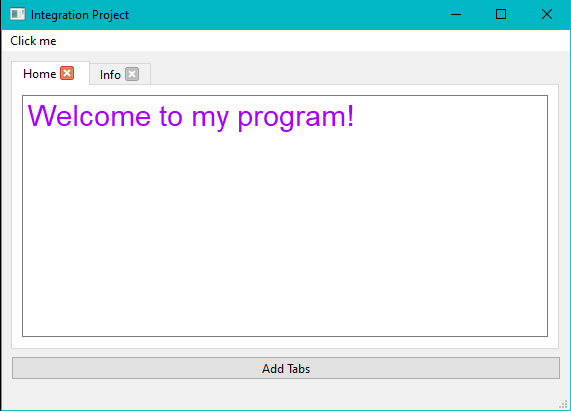
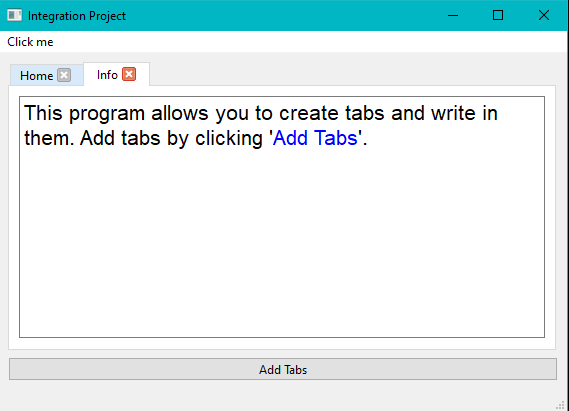
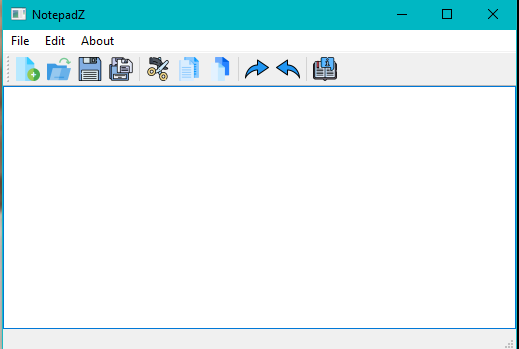
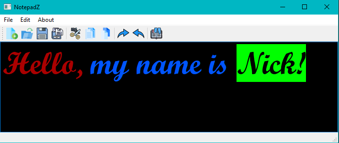
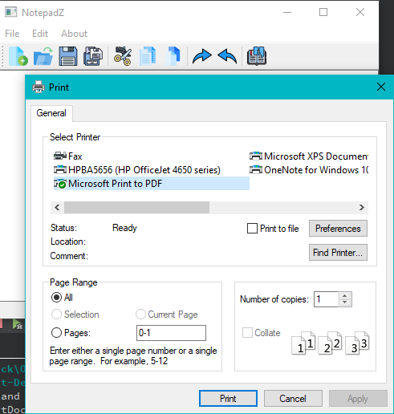

# Integration Project 3003
Integrating OOP skills from Programming II by following the [QT C++ GUI Tutorial For Beginners](https://www.udemy.com/course/qt-c-gui-tutorial-for-beginners/)
Doxygen: https://nick-toon.github.io/IntegrationOOP/html/

## QT Tutorial
- Learn the fundamentals of Qt
- Create your own, Interactive software.
- Make You Own GUI applications

## Part One

## Part Two

## Part Three

